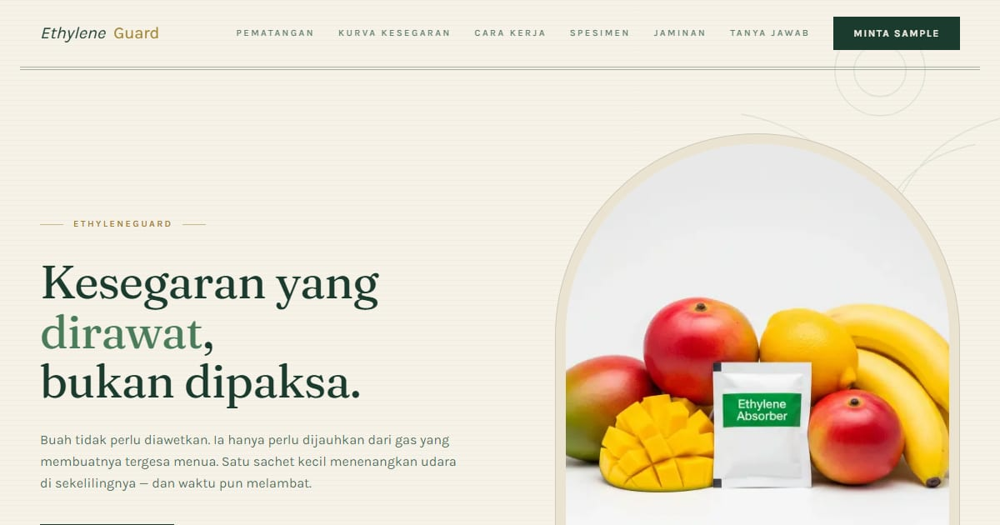

# EthyleneAbsorber — Konsep Divine | Dickson Synergy

Sachet penyerap gas etilen. Satu sachet merawat ruang 1–2 m³ selama 30 hari, hingga 45 hari pada kondisi ideal.

**Demo live:** https://absorber-divine.vercel.app



> Konsep desain untuk kontes brief EthyleneAbsorber (PT Dickson Synergy), bukan situs resmi perusahaan. Formulir di dalamnya tidak mengirim data.

## Konsep

Konsep "Divine" dengan bahasa rupa **Plate Botani**, meniru lembar spesimen herbarium: puncak lengkung, garis rambut ganda, nomor Romawi, dan Kurva Kesegaran yang membandingkan buah dengan dan tanpa sachet.

## Halaman

`/` · `/faq` · `/kontak`

## Teknologi

- Next.js 15.5 (App Router) dan React 19
- Tailwind CSS v4
- TypeScript
- Framer Motion, Lucide (ikon)
- Font: Fraunces, Karla (next/font)
- SEO: metadata per halaman, Open Graph, JSON-LD, sitemap.xml, dan robots.txt

## Menjalankan secara lokal

```bash
npm install
npm run dev
```

Buka http://localhost:3000. Untuk build produksi: `npm run build` lalu `npm start`.

---

Bagian dari koleksi 9 entri kontes desain web di [PortalKontes](https://www.pintuweb.com/kontes-desain). Dibuat oleh [PintuWeb](https://www.pintuweb.com), jasa pembuatan website.
